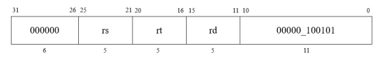
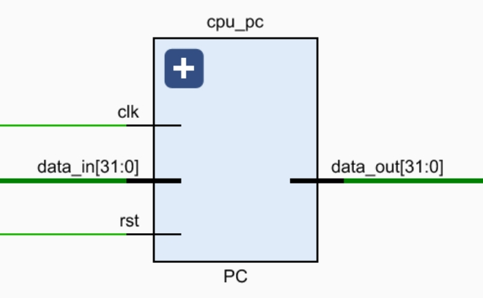
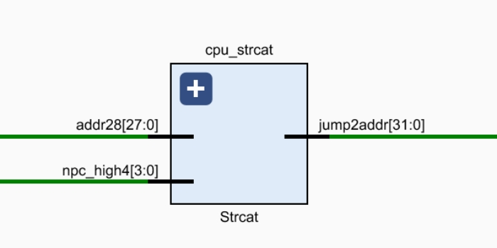
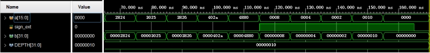

# Processor design and practice

**实验要求**

1． 实验必须提前预习，不预习不允许参加实验。

2． 实验内容按时完成，教师在课上根据完成情况给出成绩。

3． 实验不得缺席，否则将不参加最终成绩的评定；任何一个实验题目不能完成也不参加最终成绩的评定。

4． 实验环节考核不通过者，不得参加考试，也不参加最终成绩的评定。

5． 实验如果不能在指定时间完成，需降低评分，但要求必须完成。

6． 可根据设计的创新情况作适当加分处理。

7． 按时完成实验报告，在每个实验结束后一周内完成实验报告。

 

**实验报告撰写规范**

1． 实验方案部分包括系统设计要求、系统概述、技术方案、关键技术和进度安排等内容。

2． 实验设计部分包括结构设计（含系统框图和各部件功能概述）、系统工作原理描述（工作过程简述）、外接口定义（管脚定义及功能）、系统详细设计（各部件功能详述，设计方法，Verilog程序等）、系统测试（测试方案，测试波形等）等内容。

3． 实验测试部分包括测试准备条件、系统功能概述、系统功能测试（每项功能作为一个部分，要包括功能描述、测试过程和期望的测试结果）。

 

**实验项目表**

| 序号 | 实  验  项  目           | 学时 | 实验要求 | 实验类别 | 每组人数 |
| ---- | ------------------------ | ---- | -------- | -------- | -------- |
| 1    | 硬件描述语言基础         | 4    | 必修     | 设计     | 1        |
| 2    | 基本组合逻辑设计         | 4    | 必修     | 设计     | 1        |
| 3    | 内存与寄存器堆           | 8    | 必修     | 设计     | 1        |
| 4    | 给定指令系统的处理器设计 | 16   | 必修     | 设计     | 1        |

 

 

 

**实验一 硬件描述语言基础**

一、实验目的

 

1．掌握Vivado集成开发环境

2．掌握Verilog语言基本知识

3．掌握Verilog语言设计、调试及波形仿真

 

二、实验预习

1．二选一多路选择器的编码

 

module mux_2to1(

  input [1:0] d0,

  input [1:0] d1,

  input select,

  output reg [1:0] out

);

 

always @(select or d0 or d1)

begin

  if (select)

​    out = d1;

  else

​    out = d0;

end

 

endmodule

 

 

 

 

 

 

 

 

2．节拍发生器的时序图

 

module pulse_generator(

  input wire clk,

  input wire rst,

  output wire [3:0] T

);

  reg [3:0] T;

 

  always @(posedge clk or posedge rst) begin

​    if (rst) begin

​      T <= 4'b1000;

​    end else begin

​      T <= {T[0], T[3:1]};

​    end

  end

endmodule

 

 

 

 

 

 

 

 

三、实验环境（实验设备、开发环境）（预习）

 

开发环境Vivado 2020.1

Windows11 64位专业版

Visual Studio Code

 

 

 

四、实验设计

分别写出两个电路带有详细注释的Verilog实现代码：

**二选一选择器**

RTL：

// 模组：输入端有三个，select为选择信号，out为输出信号

module mux_2to1(

  input [1:0] d0,

  input [1:0] d1,

  input select,

  output reg [1:0] out

);

 

// 组合逻辑，如果select为1，则输出d1的值；如果select为0，则输出d0的值

always @(select or d0 or d1)

begin

  if (select)

​    out = d1;

  else

​    out = d0;

end

 

Endmodule

 

仿真：

module testbench_mux_2to1;

  reg [1:0] d0;   // 输入

  reg [1:0] d1;   // 输入

  reg select;    // 选择信号

  wire [1:0] out;  // 输出信号

 

  // 例化

  mux_2to1 my_mux (

​    .d0(d0),

​    .d1(d1),

​    .select(select),

​    .out(out)

  );

 

  

  initial begin

​    d0 = 2'b00;       // 输入d0为2位二进制数00

​    d1 = 2'b11;       // 输入d1为2位二进制数11

​    select = 1'b0;     // 输入select为1位二进制数0

 

​    \#10;       // 等待10ns

 

​    $finish;     // 结束仿真

  end

 

  

  always begin

​    \#5 select = ~select; // 每 5 个时间单位切换一次选择信号

  end

 

endmodule  

 

 

**节拍发生器**

RTL:

module pulse_generator(

  input wire clk,     // 输入时钟信号

  input wire rst,     // 输入复位信号

  output reg [3:0] T   // 输出脉冲生成器的输出信号

);

 

 

  always @(posedge clk or posedge rst) begin

​    if (rst) begin

​      T <= 4'b1000;        // 如果复位信号激活，则将输出设置为初始值1000

​    end else begin

​      T <= {T[0], T[3:1]};     // 在clk上升沿到来时，生成下一个状态

​    end

  end

endmodule

 

仿真：

`timescale 1ns / 1ps 

 

module testbench_pulse_generator;

  

  reg clk;     // 输入时钟信号

  reg rst;     // 输入复位信号

  wire [3:0] T;  // 输出脉冲生成器的输出信号

 

  // 实例化脉冲生成器模块

  pulse_generator pg (

​    .clk(clk),

​    .rst(rst),

​    .T(T)

  );

  

  

  initial begin

​    clk = 0;         // 初始化时钟信号为低电平

​    forever #5 clk = ~clk;  // 以5ns为间隔翻转时钟信号

  end

 

  initial begin

​    $dumpfile("pulse_generator.vcd");      //生成仿真波形文件

​    $dumpvars(0, testbench_pulse_generator);   // 保存当前模块变量值

 

​    rst = 1;     //激活复位信号

​    \#10;       // 等待10ns

​    rst = 0;     // 取消复位信号

 

​    

​    \#100;      // 继续仿真100ns

 

​    $finish;     //结束仿真

  end

endmodule

**
****五、**测试结果及实验分析

​        测试波形与测试结果：

1. 二选一选择器

 

2. 节拍发生器

实验结果分析：

1. 二选一选择器

d0的值为0，d1的值为3，当select值为0时，输出0；当select值为1时，输出3.

 

2. 节拍发生器

当rst为低电平时，clk上升沿到来时，依次向右移位

 

 

 

 

 

 

 

 

 

 

 

 

 

六、实验总结

 

1.环境准备： 安装和配置Vivado集成开发环境。

2.Verilog基础： 学习Verilog语言的基本语法和建模原理，了解模块、端口、信号等的定义。

3.设计选择器： 使用Verilog语言编写一个二选一选择器的模块，该模块应 具备两个输入和一个输出，根据某种条件（如一个控制信号）选择其中一个输入作为输出。

4.设计节拍发生器： 使用Verilog编写一个节拍发生器的模块，该模块应能生成一定频率的脉冲信号。

5.模拟测试： 在Vivado中创建一个仿真项目，测试选择器和节拍发生器的功能。通过仿真验证设计的正确性。

**实验二 基本组合逻辑设计**

| 预习成绩 | 实验成绩 | 报告成绩 | 总成绩 | 教师签字 |
| -------- | -------- | -------- | ------ | -------- |
|          |          |          |        |          |

 

一、实验目的

 

1．掌握Vivado集成开发环境

2．掌握Verilog语言基本知识

3．掌握并理解算术逻辑单元ALU的原理和设计

 

二、实验预习

1．ALU（算术逻辑单元）的16种运算的编码

module alu(

  input [31 : 0] A,

  input [31 : 0] B,

  input      Cin,

  input [4 : 0]  Card,

  

  output reg [31 : 0] F,

  output      Cout,

  output      Zero

  );

  

  wire [31:0] add_result, addc_result, sub_result, sub1_result, inv_A, inv_B, or_result, and_result, xnor_result, xor_result, nor_result;

  

  assign add_result = A + B;

  assign addc_result = add_result + Cin;

  assign sub_result = A - B;

  assign sub1_result = B - A;

  assign inv_A = ~A;

  assign inv_B = ~B;

  assign or_result = A | B;

  assign and_result = A & B;

  assign xnor_result = ~(A ^ B);

  assign xor_result = A ^ B;

  assign nor_result = ~(A & B);

  

  

  always @(*) begin

​    case (Card)

​      5'b00001 : F <= add_result; // Use non-blocking assignment

​      5'b00010 : F <= add_result + Cin;

​      5'b00011 : F <= sub_result;

​      5'b00100 : F <= sub_result - Cin;

​      5'b00101 : F <= sub1_result;

​      5'b00110 : F <= sub1_result - Cin;

​      5'b00111 : F <= A;

​      5'b01000 : F <= B;

​      5'b01001 : F <= inv_A;

​      5'b01010 : F <= inv_B;

​      5'b01011 : F <= or_result;

​      5'b01100 : F <= and_result;

​      5'b01101 : F <= xnor_result;

​      5'b01110 : F <= xor_result;

​      5'b01111 : F <= nor_result;

​      default  : F <= 32'b0; // Handle unknown Card values

​    endcase

  end

​    

  assign Cout =  (Card == 5'b00001 && (add_result[31] ^ A[31] ^ B[31])) | (Card == 5'b00010 && (addc_result[31] ^ A[31] ^ B[31] ^ Cin));

  assign Zero = (F == 32'b0);

​    

endmodule

 

 

 

 

 

 

 

 

 

 

 

 

 

 

 

 

 

 

 

三、实验环境（实验设备、开发环境）（预习）

 

开发环境Vivado 2020.1

Windows11 64位专业版

Visual Studio Code

 

 

四、实验设计

写出带有详细注释的Verilog实现代码：

1. 加法器

RTL：

module adder(

  input [31:0] A,     // 加数A

  input [31:0] B,     // 加数B

  input Cin,        // 下一级的进位

  output [31:0] Sum,    // A+B的结果

  output Cout       // 进位

);

 

wire [32:0] carry_out;        // 33位的数组，保存每一位的进位

assign carry_out[0] = Cin;      // 初始化

 

genvar i;      // 变量i

generate

  for (i = 0; i < 32; i = i + 1) begin : adder_loop

​    assign Sum[i] = A[i] ^ B[i] ^ carry_out[i];     // 计算第i位的结果

​    assign carry_out[i+1] = (A[i] & B[i]) | (A[i] & carry_out[i]) | (B[i] & carry_out[i]);

  end                           // 计算第i位的进位

endgenerate

 

assign Cout = carry_out[32];   // 最高位进位为这两个加数的进位

 

Endmodule

 

仿真：

module adder_tb;

  reg [31 : 0] A;     // 输入数据A

  reg [31 : 0] B;     // 输入数据B

  reg Cin;         // 上一级的进位

  

  wire [31 : 0] Sum;    // 结果

  wire Cout;        // 下一级的进位

  

  // 实例化

  adder uut(

​    .A(A),

​    .B(B),

​    .Cin(Cin),

​    .Sum(Sum),

​    .Cout(Cout)

  );

​    

  initial begin

​    $dumpfile("adder_tb.vcd");      // 生成波形仿真文件

​    $dumpvars(0,adder_tb);         // 保存变量值

​    

​    A = 32'hf2345678;          // 初始化A为f2345678

​    B = 32'h87654321;          // 初始化B为87654321

​    Cin = 1;               // 上一级的进位为1

​    

​    $display("Input A; %h",A);    // 打印A

​    $display("Input B; %h",B);    // 打印B

​    $display("Cin; %b",Cin);     // 打印Cin

​    

​    \#10       // 等待10ns

​    

​    $display("Sum: %h",Sum);       // 打印Sum

​    $display("Cout: %b",Cout);      // 打印Cout

​    

​    $finish;         // 结束仿真

  end

  

endmodule  

 

 

2. ALU

RTL：

module alu(

  input [31 : 0] A,   // 输入操作数 A，32 位宽

  input [31 : 0] B,   // 输入操作数 B，32 位宽

  input      Cin,  // 输入进位标志位

  input [4 : 0]  Card,  // 输入操作码，指示要执行的操作

  

  output reg [31 : 0] F, // 输出结果 F，32 位宽

  output      Cout, // 输出进位标志位

  output      Zero  // 输出零标志位

);

 

  // 内部线路声明，用于存储不同操作的中间结果

  wire [31:0] add_result, addc_result, sub_result, sub1_result, inv_A, inv_B, or_result, and_result, xnor_result, xor_result, nor_result;

  

  // 使用 assign 语句计算各种操作的中间结果

  assign add_result = A + B;

  assign addc_result = add_result + Cin;

  assign sub_result = A - B;

  assign sub1_result = B - A;

  assign inv_A = ~A;

  assign inv_B = ~B;

  assign or_result = A | B;

  assign and_result = A & B;

  assign xnor_result = ~(A ^ B);

  assign xor_result = A ^ B;

  assign nor_result = ~(A & B);

  

  // 组合逻辑块，根据操作码选择输出结果 F

  always @(*) begin

​    case (Card)

​      5'b00001 : F <= add_result; // 执行加法操作

​      5'b00010 : F <= add_result + Cin; // 执行加法进位操作

​      5'b00011 : F <= sub_result; // 执行减法操作

​      5'b00100 : F <= sub_result - Cin; // 执行减法借位操作

​      5'b00101 : F <= sub1_result; // 执行反向减法操作

​      5'b00110 : F <= sub1_result - Cin; // 执行反向减法借位操作

​      5'b00111 : F <= A; // 传递输入 A

​      5'b01000 : F <= B; // 传递输入 B

​      5'b01001 : F <= inv_A; // 执行 A 的按位取反

​      5'b01010 : F <= inv_B; // 执行 B 的按位取反

​      5'b01011 : F <= or_result; // 执行按位或操作

​      5'b01100 : F <= and_result; // 执行按位与操作

​      5'b01101 : F <= xnor_result; // 执行按位异或非操作

​      5'b01110 : F <= xor_result; // 执行按位异或操作

​      5'b01111 : F <= nor_result; // 执行按位或非操作

​      default  : F <= 32'b0; // 处理未知的操作码值

​    endcase

  end

  

  // 使用 assign 语句计算进位标志位 Cout

  assign Cout =  (Card == 5'b00001 && (add_result[31] ^ A[31] ^ B[31])) | (Card == 5'b00010 && (addc_result[31] ^ A[31] ^ B[31] ^ Cin));

  

  // 使用 assign 语句计算零标志位 Zero

  assign Zero = (F == 32'b0);

  

endmodule

 

仿真：

module alu_tb();

  reg [31:0] A, B;    // 输入操作数 A 和 B，每个为 32 位宽

  reg Cin;        // 输入进位标志位

  reg [4:0] Card;    // 输入操作码，用于选择ALU执行的操作

  wire [31:0] F;     // 输出结果 F，32 位宽

  wire Cout;       // 输出进位标志位

  wire Zero;       // 输出零标志位

  alu alu_inst(.A(A), .B(B), .Cin(Cin), .Card(Card), .F(F), .Cout(Cout), .Zero(Zero)); // 实例化ALU模块

 

  initial begin

​    A = 32'h00000010;  // 初始化操作数 A

​    B = 32'h00000008;  // 初始化操作数 B

​    Cin = 1'b1;     // 初始化进位标志位

​    Card = 5'b00001;   // 初始化操作码，选择加法操作

​    \#10;         // 等待 10 个时间单位

 

​    // 依次改变操作码以测试不同的ALU操作

​    Card = 5'b00010;

​    \#10;

​    Card = 5'b00011;

​    \#10;

​    Card = 5'b00100;

​    \#10;

​    Card = 5'b00101;

​    \#10;

​    Card = 5'b00110;

​    \#10;

​    Card = 5'b00111;

​    \#10;

​    Card = 5'b01000;

​    \#10;

​    Card = 5'b01001;

​    \#10;

​    Card = 5'b01010;

​    \#10;

​    Card = 5'b01011;

​    \#10;

​    Card = 5'b01100;

​    \#10;

​    Card = 5'b01101;

​    \#10;

​    Card = 5'b01110;

​    \#10;

​    Card = 5'b01111;

​    \#10;

​    Card = 5'b00000;   // 测试 ALU 是否正确处理未知操作码

​    \#10;

​    $finish;       // 结束仿真

  end

 

  always @(F) begin

​    $display("A = %h, B = %h, Cin = %b, Card = %d, F = %h, Cout = %b, Zero = %b", A, B, Cin, Card, F, Cout, Zero);

  end

 

endmodule

**
****五、**测试结果及实验分析

​        测试波形与测试结果：

1. 加法器

 

 

2. ALU

 

 

 

| 运算功能     | A(H)     | B(H)     | Cin  | 操作码（五位） | F(H)     | Zero |
| ------------ | -------- | -------- | ---- | -------------- | -------- | ---- |
| F=A加B       | 00000010 | 00000008 | 1    | 00001          | 00000018 | 0    |
| F=A加B加Cin  | 00000010 | 00000008 | 1    | 00010          | 00000019 | 0    |
| F=A减B       | 00000010 | 00000008 | 1    | 00011          | 00000008 | 0    |
| F=A减B减Cin  | 00000010 | 00000008 | 1    | 00100          | 00000007 | 0    |
| F=B减A       | 00000010 | 00000008 | 1    | 00101          | fffffff8 | 0    |
| F= B减A减Cin | 00000010 | 00000008 | 1    | 00110          | fffffff7 | 0    |
| F=A          | 00000010 | 00000008 | 1    | 00111          | 00000010 | 0    |
| F=B          | 00000010 | 00000008 | 1    | 01000          | 00000008 | 0    |
| F=/A         | 00000010 | 00000008 | 1    | 01001          | ffffffef | 0    |
| F=/B         | 00000010 | 00000008 | 1    | 01010          | fffffff7 | 0    |
| F=A+B        | 00000010 | 00000008 | 1    | 01011          | 00000018 | 0    |
| F=AB         | 00000010 | 00000008 | 1    | 01100          | 00000000 | 1    |
| F=A⊙B        | 00000010 | 00000008 | 1    | 01101          | ffffffe7 | 0    |
| F=A⊕B        | 00000010 | 00000008 | 1    | 01110          | 00000018 | 0    |
| F=/(AB)      | 00000010 | 00000008 | 1    | 01111          | ffffffff | 0    |
| F=0          | 00000010 | 00000008 | 1    | 00000          | 00000000 | 1    |

 

 

实验结果分析：

1. 加法器

A为f12345678，B为87654321，Cin为1.A+B的结果为17999999a，有溢出，所以Cout为1

 

2. ALU

***\*F=A加B (操作码: 00001)\****:

– A的值是 0x10 (16)，B的值是 0x08 (8)。

– 进位 Cin 为 1。

– ALU执行加法操作，结果为 0x18 (24)。

– Zero 标志位为 0，表示结果不为零。

***\*F=A加B加Cin (操作码: 00010)\****:

– 与前一个情况相同，只是操作码变为加法进位操作。

– Cin 为 1，ALU执行加法操作，结果为 0x19 (25)。

– Zero 标志位为 0，结果不为零。

***\*F=A减B (操作码: 00011)\****:

– A的值是 0x10 (16)，B的值是 0x08 (8)。

– 进位 Cin 为 1。

– ALU执行减法操作，结果为 0x08 (8)。

– Zero 标志位为 0，结果不为零。

***\*F=A减B减Cin (操作码: 00100)\****:

– 与前一个情况相同，只是操作码变为减法借位操作。

– Cin 为 1，ALU执行减法操作，结果为 0x07 (7)。

– Zero 标志位为 0，结果不为零。

***\*F=B减A (操作码: 00101)\****:

– A的值是 0x10 (16)，B的值是 0x08 (8)。

– 进位 Cin 为 1。

– ALU执行减法操作，结果为 fffffff8 (-8)。

– Zero 标志位为 0，结果不为零。

***\*F=B减A减Cin (操作码: 00110)\****:

– 与前一个情况相同，只是操作码变为减法借位操作。

– Cin 为 1，ALU执行减法操作，结果为 fffffff7 (-7)。

– Zero 标志位为 0，结果不为零。

***\*F=A (操作码: 00111)\****:

– A的值是 0x10 (16)。

– 不执行任何操作，结果仍为 0x10 (16)。

– Zero 标志位为 0，结果不为零。

***\*F=B (操作码: 01000)\****:

– B的值是 0x08 (8)。

– 不执行任何操作，结果仍为 0x08 (8)。

– Zero 标志位为 0，结果不为零。

***\*F=/A (操作码: 01001)\****:

– A的值是 0x10 (16)。

– 执行取反操作，结果为 ffffffef (-17)。

– Zero 标志位为 0，结果不为零。

***\*F=/B (操作码: 01010)\****:

– B的值是 0x08 (8)。

– 执行取反操作，结果为 fffffff7 (-9)。

– Zero 标志位为 0，结果不为零。

***\*F=A+B (操作码: 01011)\****:

– A的值是 0x10 (16)，B的值是 0x08 (8)。

– ALU执行加法操作，结果为 0x18 (24)。

– Zero 标志位为 0，结果不为零。

***\*F=AB (操作码: 01100)\****:

– A的值是 0x10 (16)，B的值是 0x08 (8)。

– 执行与操作，结果为 0x00 (0)。

– Zero 标志位为 1，结果为零。

***\*F=A⊙B (操作码: 01101)\****:

– A的值是 0x10 (16)，B的值是 0x08 (8)。

– 执行异或操作，结果为 ffffffe7 (-25)。

– Zero 标志位为 0，结果不为零。

***\*F=A⊕B (操作码: 01110)\****:

– A的值是 0x10 (16)，B的值是 0x08 (8)。

– 执行异或非操作，结果为 0x18 (24)。

– Zero 标志位为 0，结果不为零。

***\*F=/(AB) (操作码: 01111)\****:

– A的值是 0x10 (16)，B的值是 0x08 (8)。

– 执行或非操作，结果为 ffffffff (-1)。

– Zero 标志位为 0，结果不为零。

***\*F=0 (操作码: 00000)\****:

– 不论A和B的值如何，结果均为零。

– Zero 标志位为 1，结果为零。

 

 

六、实验总结

实验步骤：

环境准备： 安装和配置Vivado集成开发环境。

Verilog基础： 学习Verilog语言的基本语法、模块定义和端口声明。

加法器设计： 使用Verilog编写一个简单的加法器模块，能够接收两个输入并输出它们的和。

ALU设计： 创建一个ALU模块，具备选通输入、多种操作码、输入数据等。实现ALU的各种功能，包括加法、减法、逻辑运算等。

模拟测试： 在Vivado中创建一个仿真项目，编写测试台用于测试加法器和ALU的功能。通过仿真验证设计的正确性。

收获：

• 成功掌握了Vivado集成开发环境，学会了创建项目、编写Verilog代码、进行仿真和综合的基本操作。

• 熟悉了Verilog语言的基本语法和建模原理，能够进行简单的硬件设计。

• 实现了一个加法器和一个功能丰富的ALU，验证了它们的正确性和功能多样性。

• 学会了使用仿真工具验证硬件设计的功能，这是调试和验证硬件系统的关键技能。

• 如果有FPGA开发板，还可以将设计下载到实际硬件中，进一步验证其在硬件上的运行情况。

 

 

**实验三 存储器与寄存器堆**

| 预习成绩 | 实验成绩 | 报告成绩 | 总成绩 | 教师签字 |
| -------- | -------- | -------- | ------ | -------- |
|          |          |          |        |          |

 

一、实验目的

 

1． 熟悉并掌握 MIPS 计算机中寄存器堆的原理和设计方法

2． 理解源操作数/目的操作数的概念

3． 理解 RAM 读取、写入数据的过程

4． 掌握调用 xilinx 库 IP 实例化 RAM 的设计方法

 

二、实验预习

1．画出寄存器堆的结构框图，标出输入输出端口。

 

2．画出存储器的结构框图，标出输入输出端口（确定存储器宽度、深度和写使能位数）

 

 

 

三、实验环境（实验设备、开发环境）（预习）

开发环境Vivado 2020.1

Windows11 64位专业版

Visual Studio Code

 

四、实验设计

写出带有详细注释的Verilog实现代码：

**regfile.v**

 

**`timescale 1ns / 1ps**

 

**// 定义一个名为 regfile 的 Verilog 模块**

**module regfile(**

  **input clk,        // 时钟信号**

  **input [5:1] raddr1,    // 读端口1的寄存器地址**

  **output reg [32:1] rdata1, // 读端口1的数据输出**

  **input [5:1] raddr2,    // 读端口2的寄存器地址**

  **output reg [32:1] rdata2, // 读端口2的数据输出**

  **input we,         // 写使能信号，用于控制写操作**

  **input [5:1] waddr,    // 写入寄存器的地址**

  **input [32:1] wdata    // 写入寄存器的数据**

**);**

 

  **reg [32:1] regf[31:0]; // 定义一个包含32个32位寄存器的数组**

 

  **always @(posedge clk) begin**

​    **// 在每个上升沿时，执行以下操作**

​    **if (we) begin**

​      **regf[waddr] <= wdata; // 如果写使能信号为1，则将数据写入指定寄存器地址**

​    **end**

  **end**

 

  **always @(posedge clk) begin**

​    **// 在每个上升沿时，执行以下操作**

​    **rdata1 <= regf[raddr1]; // 将读端口1的数据设置为指定寄存器地址的数据**

​    **rdata2 <= regf[raddr2]; // 将读端口2的数据设置为指定寄存器地址的数据**

  **end**

 

**endmodule**

 

**r****am_top:**

 

**`timescale 1ns / 1ps**

 

**// 定义一个名为 ram_top 的 Verilog 模块**

**module ram_top(**

  **input     clk    ,  // 时钟信号**

  **input  [15:0] ram_addr ,  // RAM 地址输入**

  **input  [31:0] ram_wdata,  // 要写入 RAM 的数据**

  **input     ram_wen  ,  // 写使能信号，控制是否写入数据**

  **output [31:0] ram_rdata   // 从 RAM 读取的数据输出**

**);**

 

**// 实例化一个名为 block_ram 的 Block RAM 模块**

**block_ram block_ram (**

  **.clka (clk    ),    // 连接时钟信号**

  **.wea  (ram_wen  ),    // 连接写使能信号**

  **.addra(ram_addr  ),    // 连接 RAM 地址输入**

  **.dina (ram_wdata ),    // 连接要写入 RAM 的数据**

  **.douta(ram_rdata )     // 连接从 RAM 读取的数据输出**

**);**

 

**endmodule**

 

**regfile_test**

 

**module regfile_test;**

 

  **// Parameters**

  **reg clk;         // 时钟信号**

  **reg [5:1] raddr1, raddr2, waddr;  // 读写地址输入**

  **reg we;         // 写使能信号**

  **reg rwe;         // 读写使能信号**

  **reg [32:1] wdata;    // 写数据**

  **wire [32:1] rdata1, rdata2;    // 读数据**

  **reg [15:0] raddr;    // 读地址**

  **wire [31:0] rrdata;   // 从 RAM 读取的数据输出**

  **reg [31:0] temp_data;  // 临时数据**

 

  **// 实例化 regfile 模块**

  **regfile regfile_inst (**

​    **.clk(clk),**

​    **.raddr1(raddr1),**

​    **.rdata1(rdata1),**

​    **.raddr2(raddr2),**

​    **.rdata2(rdata2),**

​    **.we(we),**

​    **.waddr(waddr),**

​    **.wdata(wdata)**

  **);**

 

  **// 实例化 ram_top 模块**

  **ram_top ram1(**

​    **.clk(clk),**

​    **.ram_addr(raddr),    // RAM 地址输入**

​    **.ram_wdata(temp_data),  // 写数据**

​    **.ram_wen(rwe),      // 读写使能**

​    **.ram_rdata(rrdata)    // 读数据输出**

  **);**

 

  **// 时钟生成**

  **always begin**

​    **#5 clk = ~clk;**

  **end**

 

  **initial begin**

​    **// 初始化输入信号**

​    **clk = 0;**

​    **rwe = 0;**

​    **wdata = 32'd2;**

​    **waddr = 32'd1;**

​    **we = 0;**

 

​    **#10;**

 

​    **we = 1;**

 

​    **#10;**

 

​    **wdata = 32'd1;**

​    **waddr = 32'd5;**

 

​    **#10;**

 

​    **we = 0;**

 

​    **#10;**

 

​    **raddr1 = 32'd1;**

​    **raddr2 = 32'd5;**

 

​    **#10;**

 

​    **temp_data = rdata2;**

​    **rwe = 1;**

​    **raddr = 32'd1;**

 

​    **#10;**

 

​    **rwe = 0;**

 

​    **#10;**

​    

​    **wdata = rrdata;**

​    **waddr = 32'd3;**

​    **we = 1;**

​    

​    **#10;**

​    

​    **raddr1 = 32'd3;**

​    **we = 0;**

​    

​    **#10;**

 

​    **$finish;**

  **end**

 

**endmodule**

 

**五、**测试结果及实验分析

​        测试波形与测试结果：

 

 

实验结果分析：

1. 时钟信号 clk：检查时钟信号的边沿，确保它按预期切换。时钟应该是周期性的，并在上升沿或下降沿时触发操作。
2. 写使能信号 wen：观察wen信号的变化，检查何时启用了写操作。确保在写操作期间wen为高电平。
3. 读地址 raddr1 和 raddr2：跟踪这两个读地址信号的变化，以查看何时进行读操作。确保读地址在读操作发生时被正确设置。
4. 写地址 waddr：监视写地址信号，以查看何时进行写操作。确保写地址在写操作发生时被正确设置。
5. 写数据 wdata：观察写数据信号的变化，以查看何时写入数据。确保写数据在写操作期间包含正确的值。
6. 测试地址 test_addr：监视测试地址信号，以查看何时进行测试操作。确保测试地址在测试操作发生时被正确设置。
7. 输出数据 rdata1 和 rdata2：跟踪这两个输出数据信号的变化，以查看读操作的结果。确保输出数据在读操作期间包含正确的值。
8. 测试数据 test_data：观察测试数据信号的变化，以查看测试操作的结果。确保测试数据在测试操作期间包含正确的值。

 

 

 

1. 时钟信号 clk：

o 时钟信号用于同步RAM的读写操作。它应该按照系统时钟的频率振荡，并在上升沿或下降沿触发操作。确保时钟的稳定性和正确性非常重要。

2. RAM地址信号 ram_addr：

o ram_addr信号用于指定RAM中要读取或写入数据的地址。在RAM操作期间，确保ram_addr包含正确的地址值，且不会越界。

3. RAM写数据信号 ram_wdata：

o ram_wdata信号包含要写入RAM的数据。在RAM写操作期间，确保ram_wdata包含正确的数据。

4. RAM写使能信号 ram_wen：

o ram_wen信号用于启用RAM的写操作。当ram_wen为高电平时，RAM应该接受来自ram_wdata的数据并写入指定的地址。

5. RAM读数据信号 ram_rdata：

o ram_rdata信号是从RAM中读取的数据。在RAM读操作期间，确保ram_rdata包含从指定地址读取的正确数据。

6. RAM模块 block_ram的实例化：

block_ram模块用于具体实现RAM的读写功能。确保正确连接了ram_top模块和block_ram模块，并且信号传递正确。

 

 

六、实验总结

 

在本次实验中，我们学习了MIPS计算机中的寄存器堆是如何工作的。寄存器堆是一组用于临时存储数据的寄存器，可以用于数据操作。我们了解了寄存器堆的结构，包括寄存器的数量和位宽，以及如何通过地址访问它们。通过设计Verilog代码，我们实现了一个简单的寄存器堆，掌握了如何使用寄存器堆进行数据读取和写入操作。

在计算机体系结构中，源操作数是一个操作指令中的输入数据，而目的操作数是操作的结果数据。在本实验中，我们深入了解了这些概念。我们在Verilog代码中模拟了源操作数和目的操作数的传递，以及在操作指令执行过程中如何使用它们。

RAM（随机访问存储器）是计算机中用于存储数据的关键组件。通过本实验，我们理解了RAM的工作原理，包括如何通过地址访问RAM中的数据，以及如何在需要时写入数据。我们在Verilog代码中实现了RAM的读取和写入操作，模拟了这些过程。

Xilinx Vivado提供了强大的库IP（知识产权）来简化RAM的设计和实例化。我们学习了如何在Vivado中调用库IP来实例化RAM，并与我们的Verilog代码进行集成。这个过程包括配置RAM的大小、位宽和数据输入输出端口等参数。我们还了解了如何将RAM的实例化结果与我们的设计进行综合和调试。

 

**实验四 给定指令系统的处理器设计**

| 预习成绩 | 实验成绩 | 报告成绩 | 总成绩 | 教师签字 |
| -------- | -------- | -------- | ------ | -------- |
|          |          |          |        |          |

 

一、实验目的

 

1．掌握 Vivado 集成开发环境

2．掌握Verilog语言

3．掌握FPGA编程方法及硬件调试手段

4．深刻理解处理器结构和计算机系统的整体工作原理

 

二、实验环境（实验设备、开发环境）

 

开发环境Vivado 2020.1

Windows11 64位专业版

Visual Studio Code

 

 

 

三、设计思想（实验预习）（如空白不够，可自行加页）

1．CPU接口信号定义，填写下表

| 信号名            | 位数 | 方向 | 来源/去向                                      | 意义         |
| ----------------- | ---- | ---- | ---------------------------------------------- | ------------ |
| clk               | 32   | 输入 | cpu_top模块/instr_men,Decoder,regfile,data_mem | 时钟信号     |
| reset             | 1    | 输入 | cpu_top模块/PC,regfile,data_mem                | 复位信号     |
| debug_wb_pc       | 32   | 输出 | mux4/instr_men,NPC                             | PC的值       |
| debug_wb_rf_wen   | 1    | 输出 | Decoder/regfile                                | 写回使能信号 |
| debug_wb_rf_wdata | 32   | 输出 | Decoder/regfile                                | 写回数据     |
| Debug_wb_rf_addr  | 5    | 输出 | Decoder/regfile                                | 写回寄存器号 |
|                   |      |      |                                                |              |
|                   |      |      |                                                |              |
|                   |      |      |                                                |              |
|                   |      |      |                                                |              |
|                   |      |      |                                                |              |
|                   |      |      |                                                |              |
|                   |      |      |                                                |              |
|                   |      |      |                                                |              |

 

 

 

1． 给出处理器的设计方案，设计方案要求包括：

① 指令格式设计

运算指令[Á](#id7)

（1）加法指令 ADD rd, rs, rt

该指令将两个源寄存器内容相加，结果送回目的寄存器的操作。

具体为： [rd] <- [rs] + [rt]

（2）减法指令 SUB rd, rs, rt

该指令将两个源寄存器内容相减，结果送回目的寄存器的操作。

具体为： [rd] <- [rs] - [rt]

（3）与运算指令 AND rd, rs, rt

该指令将两个源寄存器内容相与，结果送回目的寄存器的操作。

具体为： [rd] <- [rs] & [rt]

（4）或运算指令 OR rd, rs, rt

该指令将两个源寄存器内容相或，结果送回目的寄存器的操作。

具体为： [rd] <- [rs] | [rt]

（5）异或指令 XOR rd, rs, rt

该指令将两个源寄存器内容相异或，结果送回目的寄存器的操作。

具体为： [rd] <- [rs] ⊕ [rt]

（6）小于指令 SLT rd, rs, rt

该指令将两个源寄存器内容相比较，结果决定目的寄存器的值。

具体为： [rd] <- [rs] < [rt] ? 1 : 0

（7）条件移动指令 MOVZ rd, rs, rt

该指令根据其中一个源寄存器内容，决定另一个源寄存器的值是否写回目的寄存器。

具体为： if ([rt] == 0) then [rd] <- [rs]

 

 

（8）移位指令 SLL rd, rt, sa

该指令根据sa字段指定的位移量，对寄存器rt的值进行逻辑左移，结果决定目的寄存器的值。

具体为： [rd] <- [rt] << sa

 

 

 

 

访存指令[Á](#id8)

（1）存数指令 SW rt, offset(base)

该指令将寄存器 rt的内容存于主存单元中，对应的地址由16位偏移地址 offset经符号拓展加上 base的内容生成。

具体操作为： Mem[[base] + offset] <- [rt]

（2）取数指令 LW rt, offset(base)

该指令将主存单元中的内容存于寄存器 rt，对应的地址由16位偏移地址 offset经符号拓展加上 base内容生成。

具体操作为： [rt] <- Mem[[base] + offset]

 

转移类指令

（1）条件转移（不相等跳转）指令 BNE rs, rt, offset

该指令根据寄存器 rs和 rt的内容决定下一条指令的地址，若两个寄存器内容不相等，则16位偏移 offset扩充为32位，左移2位后与NPC相加，作为下一条指令的地址，否则程序按原顺序执行。

具体操作为： PC <- ([rs] != [rt]) ? [sign_extend(offset) << 2 + NPC] : NPC

（2）无条件转移指令 J target

该指令改变下一条指令的地址，地址由指令中的26位形式地址 instr_index左移2位作为低28位，和NPC的高4位拼接而成。

具体操作为： PC <- (NPC[31:28]) ## (instr_index << 2)

 

 

 

 

 

 

 

 

 

 

 

 

 

② 处理器结构设计框图及功能描述

 

这个CPU系统是一个单周期MIPS处理器，支持一些基本的MIPS指令。以下是其主要功能：CPU能够执行MIPS指令集中的一些基本操作，包括算术运算（ADD、SUB、AND、OR、XOR、SLT、SLL）、数据传输（LW、SW）、分支（BNE）、跳转（J）、以及一个自定义的MOVZ指令。

 

 

③ 各功能模块结构设计框图及功能描述

指令存储器

  

  功能:它根据输入的地址（addr）和读使能信号（IM_R）来输出相应地址处的指令（instruction）。指令存储器在上升沿时，可以加载初始指令数据。

符号位扩展

  

  功能:此模块表示一个16位符号扩展模块，根据符号位来扩展输入为32位输出。

寄存器堆

  

  功能:此模块表示一个简单的寄存器文件，用于存储 CPU 中的寄存器数据。支持寄存器读取和写入操作。

ALU

  

  功能:此模块表示一个简单的算术逻辑单元，用于执行各种算术和逻辑操作。

译码器

  

  功能:此模块表示一个指令解码器，根据输入的指令（instruction）进行解码，输出控制信号。输出的控制信号用于控制 CPU 执行不同的操作。

数据存储器

  

  功能:此模块表示一个数据存储模块，包含一个只读存储器（ROM）和读写控制逻辑。

PC

  

  功能: 此模块表示一个简单的程序计数器。通过时钟信号（clk）驱动，根据复位信号（rst）和输入数据（data_in）来更新输出数据（data_out）。复位时将输出数据清零，否则将输入数据传递到输出数据。

NPC

  

  功能:此模块表示一个简单的下一程序计数器。它通过将输入的程序计数值（pc）增加 4 个字节的偏移量来计算下一程序计数器值（npc）。

二选一选择器1

  

  功能：此模块表示一个多路选择器，根据选择信号选择一个输入作为输出。

二选一选择器2

  

  功能：此模块表示一个多路选择器，根据选择信号选择一个输入作为输出。

二选一选择器3

  

  功能：此模块表示一个多路选择器，根据选择信号选择一个输入作为输出。

二选一选择器4

  

  功能：此模块表示一个多路选择器，根据选择信号选择一个输入作为输出。

连接器

  

功能：此模块表示一个字符串连接器。它将一个 28 位的地址（addr28）和一个 4 位的高位（npc_high4）连接成一个 32 位的跳转地址（jump2addr）。

 

 

 

④ 各模块输入输出接口信号定义（以表格形式给出，表格内容包括信号名称、位数、方向、来源/去向和信号意义）

 

模块名称及功能：PC。此模块表示一个简单的程序计数器。通过时钟信号（clk）驱动，根据复位信号（rst）和输入数据（data_in）来更新输出数据（data_out）。复位时将输出数据清零，否则将输入数据传递到输出数据。

 

| 信号名   | 位数 | 方向   | 来源/去向                                      | 意义       |
| -------- | ---- | ------ | ---------------------------------------------- | ---------- |
| clk      | 1    | input  | cpu_top模块/instr_mem,Decoder,regfile/data_mem | 时钟信号   |
| rst      | 1    | input  | cpu_top模块/instr_mem,Decoder,regfile/data_mem | 复位信号   |
| data_in  | 32   | output | mux1                                           | 输入新pc值 |
| data_out | 32   | output | instr_mem                                      | 输出pc值   |
|          |      |        |                                                |            |
|          |      |        |                                                |            |

 

 

 

模块名称及功能：NPC。此模块表示一个简单的下一程序计数器。它通过将输入的程序计数值（pc）增加 4 个字节的偏移量来计算下一程序计数器值（npc）。

 

| 信号名 | 位数 | 方向   | 来源/去向 | 意义                   |
| ------ | ---- | ------ | --------- | ---------------------- |
| pc     | 32   | input  | pc        | 输入当前pc的值         |
| npc    | 32   | output | mux1      | 更新pc的值，输出到mux1 |
|        |      |        |           |                        |
|        |      |        |           |                        |
|        |      |        |           |                        |
|        |      |        |           |                        |
|        |      |        |           |                        |
|        |      |        |           |                        |

 

 

模块名称及功能：Strcat。此模块表示一个字符串连接器。它将一个 28 位的地址（addr28）和一个 4 位的高位（npc_high4）连接成一个 32 位的跳转地址（jump2addr）。

 

| 信号名    | 位数 | 方向   | 来源/去向 | 意义           |
| --------- | ---- | ------ | --------- | -------------- |
| addr28    | 28   | input  | instr_mem | offest+4后的值 |
| npc_high4 | 4    | input  | npc       | npc高4位的值   |
| jump2addr | 32   | output | mux1      | 帮助实现J指令  |
|           |      |        |           |                |
|           |      |        |           |                |
|           |      |        |           |                |
|           |      |        |           |                |
|           |      |        |           |                |

 

 

模块名称及功能：instr_mem。它根据输入的地址（addr）和读使能信号（IM_R）来输出相应地址处的指令（instruction）。指令存储器在上升沿时，可以加载初始指令数据。

 

| 信号名      | 位数 | 方向   | 来源/去向                                      | 意义           |
| ----------- | ---- | ------ | ---------------------------------------------- | -------------- |
| clk         | 1    | input  | cpu_top模块/instr_mem,Decoder,regfile/data_mem | 时钟信号       |
| addr        | 32   | input  | pc                                             | 确认指令的地址 |
| IM_R        | 1    | input  | decoder                                        | 使能信号       |
| rst         | 1    | input  | cpu_top模块/instr_mem,Decoder,regfile/data_mem | 复位信号       |
| instruction | 32   | output | decoder/regfile/S_EXT16                        | 输出指令       |
|             |      |        |                                                |                |
|             |      |        |                                                |                |
|             |      |        |                                                |                |

 

 

模块名称及功能：decoder。此模块表示一个指令解码器，根据输入的指令（instruction）进行解码，输出控制信号。输出的控制信号用于控制 CPU 执行不同的操作。

 

| 信号名      | 位数 | 方向   | 来源/去向                                      | 意义                 |
| ----------- | ---- | ------ | ---------------------------------------------- | -------------------- |
| instruction | 32   | input  | instr_mem                                      | 当前指令             |
| clk         | 1    | input  | cpu_top模块/instr_mem,Decoder,regfile/data_mem | 时钟信号             |
| zero        | 1    | input  | ALU                                            | 0标志位              |
| Dstop       | 1    | input  | ALU                                            | movz写回使能信号     |
| rs_data     | 32   | input  | regfile                                        | regfile              |
| rt_data     | 32   | input  | regfile                                        | regfile              |
| IM_R        | 1    | output | instr_mem                                      | 指令存储器写使能信号 |
| RF_W        | 1    | output | regfilr                                        | 寄存器写使能信号     |
| M1          | 1    | output | mux1                                           | 二选一选择器选择信号 |
| M2          | 1    | output | mux2                                           | 二选一选择器选择信号 |
| M3          | 1    | output | mux3                                           | 二选一选择器选择信号 |
| M4          | 1    | output | mux4                                           | 二选一选择器选择信号 |
| M5          | 1    | output | mux5                                           | 二选一选择器选择信号 |
| DM_CS       | 1    | out[ut | 数据存储                                       | 数据存储器片选信号   |
| ALU_OP      | 3    | out[ut | ALU                                            | ALU操作op值          |
| DM_R        | 1    | output | 数据存储器                                     | 数据存储器读使能信号 |
| DM_W        | 1    | output | 数据存储器                                     | 数据存储器写使能信号 |
| sign_ext    | 1    | output | S_EXT                                          | 符号位扩展信号       |

 

 

模块名称及功能：regfile。此模块表示一个指令解码器，根据输入的指令（instruction）进行解码，输出控制信号。输出的控制信号用于控制 CPU 执行不同的操作。

 

| 信号名 | 位数 | 方向   | 来源/去向                                      | 意义               |
| ------ | ---- | ------ | ---------------------------------------------- | ------------------ |
| clk    | 1    | input  | cpu_top模块/instr_mem,Decoder,regfile/data_mem | 时钟信号           |
| rst    | 1    | input  | cpu_top模块/instr_mem,Decoder,regfile/data_mem | 复位信号           |
| rf_w   | 1    | input  | decoder                                        | 写使能信号         |
| raddr1 | 32   | input  | decoder                                        | rs寄存器号         |
| raddr2 | 32   | input  | decoder                                        | rt寄存器号         |
| waddr  | 32   | input  | decoder                                        | 写入数据的寄存器号 |
| wdata  | 32   | input  | decoder                                        | 写入的数据         |
| rdata1 | 32   | output | alu                                            | 传输rs的数据       |
| rdata2 | 32   | output | mux3                                           | 传输rt是数据       |
|        |      |        |                                                |                    |
|        |      |        |                                                |                    |
|        |      |        |                                                |                    |

​	

 

 

模块名称及功能：ALU。此模块表示一个简单的算术逻辑单元，用于执行各种算术和逻辑操作。

 

| 信号名 | 位数 | 方向   | 来源/去向     | 意义                   |
| ------ | ---- | ------ | ------------- | ---------------------- |
| a      | 32   | input  | regflie       | 操作数                 |
| b      | 32   | input  | mux3          | 操作数                 |
| alu_op | 3    | input  | decoder       | 操作码，执行相应的操作 |
| sa     | 5    | input  | instr_mem     | 移位的数据值           |
| r      | 32   | output | data_mem/mux2 | 输出结果               |
| zero   | 1    | output | decoder       | 0标志位                |
| Astop  | 1    | output | decoder       | movz写回使能信号       |
|        |      |        |               |                        |

 

模块名称及功能：mux。此模块表示一个多路选择器，根据选择信号选择一个输入作为输出。

 

| 信号名 | 位数 | 方向   | 来源/去向                             | 意义        |
| ------ | ---- | ------ | ------------------------------------- | ----------- |
| a      | 32   | input  | S_EXT/alu/data_mem/npc/strcat/regfile | 可选择数据1 |
| b      | 32   | input  | S_EXT/alu/data_mem/npc/strcat/regfile | 可选择数据2 |
| select | 1    | input  | decoder                               | 选择信号    |
| r      | 32   | output | pc/alu/mux1/regfile                   | 输出结果    |
|        |      |        |                                       |             |
|        |      |        |                                       |             |
|        |      |        |                                       |             |
|        |      |        |                                       |             |

 

 

模块名称及功能：S_EXT。此模块表示一个16位符号扩展模块，根据符号位来扩展输入为32位输出。

 

| 信号名   | 位数 | 方向   | 来源/去向 | 意义               |
| -------- | ---- | ------ | --------- | ------------------ |
| a        | 16   | input  | instr_mem | 不相等跳转的低16位 |
| sign_ext | 1    | input  | decoder   | 符号位扩展使能信号 |
| b        | 32   | output | mux3      | 输出扩展后的数据   |
|          |      |        |           |                    |
|          |      |        |           |                    |
|          |      |        |           |                    |
|          |      |        |           |                    |
|          |      |        |           |                    |

 

 

模块名称及功能：data_mem。此模块表示一个数据存储模块，包含一个只读存储器（ROM）和读写控制逻辑。

 

| 信号名 | 位数 | 方向   | 来源/去向                                      | 意义         |
| ------ | ---- | ------ | ---------------------------------------------- | ------------ |
| clk    | 1    | input  | cpu_top模块/instr_mem,Decoder,regfile/data_mem | 时钟信号     |
| rst    | 1    | input  | cpu_top模块/instr_mem,Decoder,regfile/data_mem | 复位信号     |
| CS     | 1    | input  | decoder                                        | 片选信号     |
| DM_W   | 1    | input  | decoder                                        | 写使能信号   |
| DM_R   | 1    | input  | decoder                                        | 读使能信号   |
| addr   | 32   | input  | alu                                            | 地址         |
| wdata  | 32   | output | regfile                                        | 对应的写数据 |
| rdata  | 32   | output | mux2                                           | 对应的读数据 |

 

 

 

四、实验设计及测试（如空白不够，可自行加页）

**用Verilog语言实现处理器设计**

要求采用结构化设计方法，用Verilog语言实现处理器的设计。设计包括：

1 各模块的详细设计（包括各模块功能详述，设计方法，Verilog语言实现等）

PC:

/******************************************************************************

\* Function: 程序计数器（PC）模块

*

\* 模块功能描述:

\* - 此模块表示一个简单的程序计数器。

\* - 通过时钟信号（clk）驱动，根据复位信号（rst）和输入数据（data_in）来更新输出数据（data_out）。

\* - 复位时将输出数据清零，否则将输入数据传递到输出数据。

*

\* 设计方法:

\* - 通过时钟边沿检测，以确定何时更新输出数据。

\* - 当复位信号（rst）为真时，将输出数据（data_out）清零。

\* - 否则，在时钟上升沿时将输入数据（data_in）传递到输出数据。

*

******************************************************************************/

 

`timescale 1ns / 1ps

 

module PC(

  input clk,    // 时钟信号

  input rst,    // 复位信号

  input [31:0] data_in,  // 输入数据

  

  output reg [31:0] data_out  // 输出数据

);

 

  always @ (posedge clk) begin

​    if (!rst) begin

​      data_out <= 32'b0;  // 复位时，清零输出数据

​    end

​    else begin

​      data_out <= data_in;  // 否则将输入数据传递到输出数据

​    end

  end

 

endmodule

 

NPC:

/******************************************************************************

\* Function: 下一程序计数器（NPC）模块

*

\* 模块功能描述:

\* - 此模块表示一个简单的下一程序计数器。

\* - 它通过将输入的程序计数器值（pc）增加 4 个字节的偏移量来计算下一程序计数器值（npc）。

*

\* 设计方法:

\* - 输入的程序计数器值（pc）加上 4 用于计算下一程序计数器值（npc）。

*

******************************************************************************/

 

`timescale 1ns / 1ps

 

module NPC(

  input [31:0] pc,   // 输入的程序计数器值

  output [31:0] npc  // 输出的下一程序计数器值

);

 

  assign npc = pc + 32'd4;  // 下一程序计数器值等于输入值加上 4

 

endmodule

 

Strcat:

/******************************************************************************

\* Function: 字符串连接器（Strcat）模块

*

\* 模块功能描述:

\* - 此模块表示一个字符串连接器。

\* - 它将一个 28 位的地址（addr28）和一个 4 位的高位（npc_high4）连接成一个 32 位的跳转地址（jump2addr）。

*

\* 设计方法:

\* - 使用 assign 语句将输入的高位（npc_high4）连接到输出的跳转地址（jump2addr）的高位。

\* - 使用 assign 语句将输入的地址（addr28）连接到输出的跳转地址（jump2addr）的低位。

*

******************************************************************************/

 

`timescale 1ns / 1ps

 

module Strcat(

  input [27:0] addr28,     // 输入的 28 位地址

  input [3:0] npc_high4,   // 输入的 4 位高位

  

  output [31:0] jump2addr   // 输出的 32 位跳转地址

);

 

  assign jump2addr[31:28] = npc_high4;  // 连接输入的高位到输出的高位

  assign jump2addr[27:0] = addr28;     // 连接输入的地址到输出的低位

 

endmodule

 

instr_mem:

/******************************************************************************

\* Function: 指令存储器（Instr_Mem）模块

*

\* 模块功能描述:

\* - 此模块表示一个指令存储器。

\* - 它根据输入的地址（addr）和读使能信号（IM_R）来输出相应地址处的指令（instruction）。

\* - 指令存储器在上升沿时，可以加载初始指令数据。

*

\* 设计方法:

\* - 使用 reg 数组 RAM 来存储指令数据，大小为 256 个 32 位指令。

\* - 在上升沿时，如果复位信号（rst）为低电平，则从文件 "E:/RTL/Single_CPU/data/inst_data.txt" 读取并加载指令数据到 RAM 中。

\* - 使用 assign 语句根据读使能信号（IM_R）和输入地址（addr）来选择输出指令（instruction）。

*

******************************************************************************/

 

`timescale 1ns / 1ps

 

module instr_mem(

  input clk,          // 时钟信号

  input [31:0] addr,      // 输入的地址

  input IM_R,         // 读使能信号

  input rst,          // 复位信号

  output [31:0] instruction  // 输出的指令

);

 

  reg [31:0] RAM [255:0];   // 存储指令数据的数组，共 256 个 32 位指令

 

  always @ (posedge clk) begin

​    if (!rst) begin

​      $readmemh("E:/RTL/Single_CPU/data/inst_data.txt", RAM);

​    end

  end

 

  assign instruction = (IM_R) ? RAM[addr[7:2]] : 32'bx;  // 根据读使能信号和地址选择输出指令

 

endmodule

 

decoder:

/******************************************************************************

\* Function: 指令解码器（Decoder）模块

*

\* 模块功能描述:

\* - 此模块表示一个指令解码器，根据输入的指令（instruction）进行解码，输出控制信号。

\* - 输出的控制信号用于控制 CPU 执行不同的操作。

*

\* 设计方法:

\* - 使用多个 wire 来解码指令，生成不同的控制信号。

\* - 使用 assign 语句将指令解码结果与控制信号相连。

*

******************************************************************************/

 

`timescale 1ns / 1ps

 

module Decoder(

  input [31:0] instruction,  // 输入的指令

  input clk,          // 时钟信号

  input zero,         // 零标志位

​	input Dstop,         // 停止信号

  input [31:0] rs_data,    // 寄存器 rs 数据

  input [31:0] rt_data,    // 寄存器 rt 数据

  output IM_R,         // 指令存储器读使能

  output RF_W,         // 寄存器文件写使能

  output M1,          // 内存控制信号 M1

  output M2,          // 内存控制信号 M2

  output M3,          // 内存控制信号 M3

  output M4,          // 内存控制信号 M4

  output M5,          // 内存控制信号 M5

  output DM_CS,        // 数据存储器控制信号

  output [2:0] ALU_OP,     // ALU 操作码

  output DM_R,         // 数据存储器读使能

  output DM_W,         // 数据存储器写使能

  output sign_ext       // 符号扩展控制信号

);

 

  // 对输入指令进行位切割，生成相应的操作码和寄存器编号

  wire [5:0] func = instruction[5:0];

  wire [5:0] op = instruction[31:26];

  wire [4:0] rs = instruction[25:21];

  wire [4:0] rt = instruction[20:16];

  wire R_type = ~|op;

 

  // 根据不同的操作码和功能位生成控制信号

  wire ADD_, SUB_, AND_, OR_, XOR_, SLT_, MOVZ_, SLL_;

  wire LW_, SW_;

  wire BNE_, J_;

 

  // R-Type 操作码

  assign ADD_ = R_type & func[5] & ~func[4] & ~func[3] & ~func[2] & ~func[1] & ~func[0];

  assign SUB_ = R_type & func[5] & ~func[4] & ~func[3] & ~func[2] & func[1] & ~func[0];

  assign AND_ = R_type & func[5] & ~func[4] & ~func[3] & func[2] & ~func[1] & ~func[0];

  assign OR_ = R_type & func[5] & ~func[4] & ~func[3] & func[2] & ~func[1] & func[0];

  assign XOR_ = R_type & func[5] & ~func[4] & ~func[3] & func[2] & func[1] & ~func[0];

  assign SLT_ = R_type & func[5] & ~func[4] & func[3] & ~func[2] & func[1] & ~func[0];

  assign MOVZ_ = R_type & ~func[5] & ~func[4] & func[3] & ~func[2] & func[1] & ~func[0];

  assign SLL_ = R_type & ~func[5] & ~func[4] & ~func[3] & ~func[2] & ~func[1] & ~func[0];

 

  // I-Type 操作码

  assign SW_ = ~R_type & op[5] & ~op[4] & op[3] & ~op[2] & op[1] & op[0];

  assign LW_ = ~R_type & op[5] & ~op[4] & ~op[3] & ~op[2] & op[1] & op[0];

  assign BNE_ = ~R_type & ~op[5] & ~op[4] & ~op[3] & op[2] & ~op[1] & op[0];

  assign J_ = ~R_type & ~op[5] & ~op[4] & ~op[3] & ~op[2] & op[1] & ~op[0];

 

  // 指令存储器读使能信号始终为 1

  assign IM_R = 1;

 

  // 决定是否需要写寄存器文件

  assign RF_W = ADD_ | SUB_ | AND_ | OR_ | XOR_ | SLT_ | MOVZ_ | LW_ | SLL_;

 

  // 决定是否需要访问数据存储器

  assign DM_CS = LW_ | SW_;

  assign DM_R = LW_;

  assign DM_W = SW_;

 

  // 根据操作码生成 ALU 操作码

  assign ALU_OP[2] = XOR_ | SLT_ | MOVZ_ | SLL_;

  assign ALU_OP[1] = AND_ | OR_ | MOVZ_ | SLL_;

  assign ALU_OP[0] = SUB_ | OR_ | SLT_ | SLL_;

 

  // 决定内存控制信号

  assign M1 = ADD_ | SUB_ | AND_ | OR_ | XOR_ | SLT_ | MOVZ_ | LW_ | SW_ | BNE_ | SLL_ | !(ADD_ | SUB_ | AND_ | OR_ | XOR_ | SLT_ | MOVZ_ | LW_ | SW_ | BNE_ | SLL_ | J_);

  assign M2 = ADD_ | SUB_ | AND_ | OR_ | XOR_ | SLT_ | MOVZ_ | SLL_;

  assign M3 = LW_ | SW_;

  assign M4 = ADD_ | SUB_ | AND_ | OR_ | XOR_ | SLT_ | MOVZ_ | SLL_ | LW_ | SW_ | SLL_ | (BNE_ && rs_data == rt_data);

  assign M5 = LW_;

 

  // 决定是否进行符号扩展

  assign sign_ext = LW_ | SW_ | BNE_ | J_;

 

endmodule

 

regfile:

/******************************************************************************

\* Function: 寄存器文件（Register File）模块

*

\* 模块功能描述:

\* - 此模块表示一个简单的寄存器文件，用于存储 CPU 中的寄存器数据。

\* - 支持寄存器读取和写入操作。

*

\* 设计方法:

\* - 使用一个 reg 数组来存储寄存器数据。

\* - 在时钟上升沿处理写入操作，将数据写入指定寄存器。

\* - 在时钟上升沿处理读取操作，将寄存器数据输出。

*

******************************************************************************/

 

`timescale 1ns / 1ps

 

module regfile(

  input clk,        // 时钟信号

  input rst,        // 复位信号

  input rf_w,        // 寄存器写使能信号

  input [4:0] raddr1,    // 读取寄存器的地址1

  input [4:0] raddr2,    // 读取寄存器的地址2

  input [4:0] waddr,    // 写入寄存器的地址

  input [31:0] wdata,    // 写入寄存器的数据

  output [31:0] rdata1,   // 读取的寄存器数据1

  output [31:0] rdata2   // 读取的寄存器数据2

);

 

  reg [31:0] array_reg[31:0]; // 寄存器文件数组，存储32个寄存器的数据

 

  integer i;

 

  always @ (posedge clk) begin

​    if (!rst) begin

​      i = 0;

​      while (i < 32) begin

​        array_reg[i] = 32'b0; // 复位时将所有寄存器清零

​        i = i + 1;

​      end

​    end

​    if (rf_w) begin

​      if (waddr != 0)

​        array_reg[waddr] = wdata; // 在写使能信号为真且写地址不为0时，将数据写入指定寄存器

​    end

  end

 

  assign rdata1 = array_reg[raddr1]; // 输出读取的寄存器数据1

  assign rdata2 = array_reg[raddr2]; // 输出读取的寄存器数据2

 

endmodule

 

ALU:

/******************************************************************************

\* Function: 算术逻辑单元（ALU）模块

*

\* 模块功能描述:

\* - 此模块表示一个简单的算术逻辑单元，用于执行各种算术和逻辑操作。

*

\* 设计方法:

\* - 使用一个 case 语句来根据指定的操作码执行相应的操作。

\* - 输出运算结果和零标志。

*

******************************************************************************/

 

`timescale 1ns / 1ps

 

module alu(

  input [31:0] a,     // 输入操作数a

  input [31:0] b,     // 输入操作数b

  input [2:0]  alu_op,  // ALU操作码

​	input [4:0] sa,     // 移位操作时的移位位数

  output [31:0] r,    // 运算结果

  output zero,      // 零标志，当r为零时为1

​	output reg Astop    // 停机信号

);

 

  reg [31:0] result;   // 存储运算结果

 

  always @ (*) begin

​    case (alu_op)

​      `ADD:      // 加法操作

​        result = a + b;

​      `SUB:      // 减法操作

​        result = a - b;

​      `AND:      // 与操作

​        result = a & b;

​      `OR:      // 或操作

​        result = a | b;

​      `XOR:      // 异或操作

​        result = a ^ b;

​      `SLT:      // 设置小于操作

​        if (a < b) result = 1;

​        else result = 0;

​      `MOVZ:     // 移动零操作

​        if (b == 0) result = a;

​        else Astop = 0; // 如果b非零，停机信号置零

​      `SLL:      // 逻辑左移操作

​        result = b << sa;

​      default: ;   // 默认情况，不执行操作

​    endcase

  end

 

  assign r = result;    // 输出运算结果

  assign zero = (r == 0) ? 1'b1 : 1'b0; // 判断是否为零

endmodule

 

Mux:

/******************************************************************************

\* Function: 多路选择器（Mux）模块

*

\* 模块功能描述:

\* - 此模块表示一个多路选择器，根据选择信号选择一个输入作为输出。

*

\* 参数:

\* - WIDTH: 输入宽度，默认为32位。

*

\* 设计方法:

\* - 使用一个 always 块，根据选择信号来选择输入a或输入b，并将结果输出到r。

*

******************************************************************************/

 

`timescale 1ns / 1ps

 

module mux #(parameter WIDTH = 32) (

  input [WIDTH - 1: 0] a,    // 输入a

  input [WIDTH - 1: 0] b,    // 输入b

  input select,         // 选择信号

  output reg [WIDTH - 1: 0] r  // 输出结果

);

 

  always @(*) begin

​    if (select) begin

​      r = a;         // 当选择信号为1时，选择输入a

​    end

​    else begin

​      r = b;         // 当选择信号为0时，选择输入b

​    end

  end

 

endmodule

 

 

S_EXT:

/******************************************************************************

\* Function: 16位符号扩展模块

*

\* 模块功能描述:

\* - 此模块表示一个16位符号扩展模块，根据符号位来扩展输入为32位输出。

*

\* 参数:

\* - DEPTH: 输入宽度，默认为16位。

*

\* 设计方法:

\* - 使用一个 always 块，根据输入信号a和符号扩展信号sign_ext来进行符号扩展。

\* - 如果符号扩展信号为1且输入a的符号位为1，将输出b的高16位设置为全1，其余位保持不变。

\* - 否则，将输出b的高16位设置为全0，其余位保持不变。

*

******************************************************************************/

 

`timescale 1ns/1ps

 

module S_EXT16 #(parameter DEPTH = 16) (

  input [DEPTH - 1 : 0] a,   // 输入a

  input sign_ext,        // 符号扩展信号

  output reg [31 : 0] b    // 输出b

);

 

  always @ (a or sign_ext) begin

​    if (sign_ext == 1 && a[DEPTH - 1] == 1) begin

​      b[31:0] = 32'hffffffff;   // 符号扩展为全1

​      b[DEPTH - 1:0] = a[DEPTH - 1:0];

​    end

​    else begin

​      b[31:0] = 32'h00000000;   // 符号扩展为全0

​      b[DEPTH - 1:0] = a[DEPTH - 1:0];

​    end

  end

endmodule

 

data_mem:

/******************************************************************************

\* 数据存储模块

*

\* 模块功能描述:

\* - 此模块表示一个数据存储模块，包含一个只读存储器（ROM）和读写控制逻辑。

*

\* 参数:

\* - 无

*

\* 设计方法:

\* - 使用一个 always 块，在上升沿时加载只读存储器（ROM）的数据。

\* - 使用一个 always 块，在上升沿时根据控制信号（CS、DM_R）从ROM中读取数据。

\* - 使用一个 always 块，在上升沿时根据控制信号（CS、DM_W）向ROM中写入数据。

*

******************************************************************************/

 

`timescale 1ns / 1ps

 

module data_mem (

  input clk,          // 时钟信号

  input rst,          // 复位信号

  input CS,           // 控制信号，表示数据存储器是否可用

  input DM_W,          // 控制信号，表示写入使能

  input DM_R,          // 控制信号，表示读取使能

  input [31:0] addr,      // 地址信号

  input [31:0] wdata,      // 待写入数据

  output [31:0] rdata      // 读取的数据

);

 

  reg [31:0] ROM [255:0];   // 只读存储器（ROM）

 

  always @(posedge clk) begin

​    if (!rst) begin

​      $readmemh("E:/RTL/Single_CPU/data/data_data.txt", ROM); // 在复位时从文件加载ROM数据

​    end

  end

 

  assign rdata = (CS & DM_R) ? ROM[addr[7:2]] : 32'b0; // 根据控制信号读取数据

 

  always @(posedge clk) begin

​    if (CS) begin

​      if (DM_W) begin

​        ROM[addr[7:2]] <= wdata; // 根据控制信号写入数据

​      end

​    end

  end

 

endmodule

 

 

2 系统的详细设计（包括系统功能详述，设计方法，Verilog语言实现等）

 

 

1. 系统功能详述

这个CPU系统是一个单周期MIPS处理器，支持一些基本的MIPS指令。以下是其主要功能：

 

指令执行： CPU能够执行MIPS指令集中的一些基本操作，包括算术运算（ADD、SUB、AND、OR、XOR、SLT、SLL）、数据传输（LW、SW）、分支（BNE）、跳转（J）、以及一个自定义的MOVZ指令。

 

寄存器文件： CPU具有一个寄存器文件，用于存储和读取数据。寄存器文件有32个32位寄存器。通过regfile模块实现。

 

数据存储器： 用于存储数据的数据存储器（Data Memory）具有简单的读写功能，支持LW和SW指令。通过data_mem模块实现。

 

ALU： 算术逻辑单元（ALU）负责执行算术和逻辑操作，根据指令选择不同的操作。通过alu模块实现。

 

PC和NPC： CPU有一个程序计数器（PC）和一个下一条指令的程序计数器（NPC）。NPC的值总是比PC大4，以便顺序执行指令。通过PC和NPC模块实现。

 

指令内存： 用于存储指令的指令内存。通过instr_mem模块实现。

 

控制逻辑： CPU的控制逻辑负责解码指令，生成控制信号，以及协调各个模块的工作。通过Decoder模块实现。

 

2. 设计方法

这个CPU系统的设计方法主要包括以下几个步骤：

 

指令集定义： 首先，定义所支持的MIPS指令集，包括指令的操作码、功能码以及操作数。

 

模块划分： 将CPU系统划分为不同的模块，每个模块负责执行特定的功能。模块包括寄存器文件、数据存储器、ALU、PC/NPC、指令内存和控制逻辑。

 

模块设计： 对每个模块进行详细的设计，包括模块的输入、输出、内部数据路径和控制逻辑。

 

时序设计： 确定模块之间的时序关系，包括时钟信号的分配、时序逻辑的设计以及数据通路的设置。

 

Verilog实现： 使用Verilog硬件描述语言实现每个模块，并确保模块之间的接口匹配。

 

集成测试： 将所有模块集成在一起，进行功能验证和时序分析，确保CPU能够正确执行指令。

 

3. Verilog语言实现

cpu_top:

 

// 功能描述：

// 这个模块包含了 CPU 测试的顶层逻辑。它读取 CPU 运行轨迹数据，与 CPU 的输出进行比较，以验证 CPU 的正确性。

// 设计方法：

// 1. 从文件读取 CPU 运行轨迹数据。

// 2. 在时钟上升沿检查 CPU 输出是否匹配预期结果。

// 3. 如果匹配，测试通过；否则，报错。

 

 

`timescale 1ns / 1ps

 

// 定义 trace 文件路径和测试次数

`define TRACE_FILE_PATH "E:/RTL/Single_CPU/data/cpu_trace"

`define TEST_COUNT 11

 

module cpu_top(

  input clk,

  input reset

);

 

  // 定义存储 CPU 运行轨迹数据的寄存器

  reg [71:0] cpu_trace_data [`TEST_COUNT - 1 : 0];

 

  initial begin

​    // 从 trace 文件读取 CPU 运行轨迹数据

​    $readmemh(`TRACE_FILE_PATH, cpu_trace_data);

  end

 

  // 定义调试信号

  wire [31:0] debug_wb_pc;

  wire debug_wb_rf_wen;

  wire [4:0] debug_wb_rf_addr;

  wire [31:0] debug_wb_rf_wdata;

 

  // 实例化 CPU 模块

  cpu U_cpu(

​    .clk(clk),

​    .reset(reset),

​    .debug_wb_pc(debug_wb_pc),

​    .debug_wb_rf_wen(debug_wb_rf_wen),

​    .debug_wb_rf_addr(debug_wb_rf_addr),

​    .debug_wb_rf_wdata(debug_wb_rf_wdata)

  );

 

  // 定义测试相关的寄存器和信号

  reg test_err;

  reg test_pass;

  reg [31:0] test_counter;

  reg [15:0] leds_reg;

 

  // 从 trace 数据中提取参考值

  wire [31:0] test_wb_pc = cpu_trace_data[test_counter][71:40];

  wire [4:0] test_wb_rf_addr = cpu_trace_data[test_counter][36:32];

  wire [31:0] test_wb_rf_wdata = cpu_trace_data[test_counter][31:0];

 

  always @(posedge clk) begin

​    if (!reset) begin

​      // 初始化测试相关的寄存器和信号

​      leds_reg <= 16'hffff;

​      test_err <= 1'b0;

​      test_pass <= 1'b0;

​      test_counter <= 0;

​    end

​    else if (debug_wb_pc == 32'h00000040 && !test_err) begin

​      // 当 PC 达到特定值时，测试通过

​      $display("   ----PASS!!!");

​      $display("Test end!");

​      $display("==============================================================");

​      test_pass <= 1'b1;

​      leds_reg <= 16'h0000;

​      \#5;

​      $finish;

​    end

​    else if (debug_wb_rf_wen && |debug_wb_rf_addr && !test_pass) begin

​      if (debug_wb_pc != test_wb_pc || debug_wb_rf_addr != test_wb_rf_addr || debug_wb_rf_wdata != test_wb_rf_wdata) begin

​        // 如果写回数据不匹配参考值，报错

​        $display("--------------------------------------------------------------");

​        $display("Error!!!");

​        $display("   Reference : PC = 0x%8h, write back reg number = %2d, write back data = 0x%8h", test_wb_pc, test_wb_rf_addr, test_wb_rf_wdata);

​        $display("   Error   : PC = 0x%8h, write back reg number = %2d, write back data = 0x%8h", debug_wb_pc, debug_wb_rf_addr, debug_wb_rf_wdata);

​        $display("--------------------------------------------------------------");

​        $display("==============================================================");

​        test_err <= 1'b1;

​        \#5;

​        $finish;

​      end

​      else begin

​        // 测试通过，增加测试计数器

​        test_counter <= test_counter + 1;

​      end

​    end

  end

 

endmodule

 

cpu:

/******************************************************************************

\* Function: CPU模块

*

\* 模块功能描述:

\* - 此模块表示中央处理器（CPU）的顶层模块。

\* - 包含一个指令存储器、指令解码器、程序计数器、寄存器文件、算术逻辑单元、数据存储器等模块，

\*  以实现CPU的基本功能。

\* - 此CPU执行给定的指令集，包括加载/存储、算术/逻辑运算等操作。

*

\* 设计方法:

\* - CPU顶层模块通过连接各个功能模块，实现基本的指令执行功能。

\* - 指令从指令存储器读取，然后通过指令解码器译码，控制各个功能模块的操作。

\* - 程序计数器用于指向下一条待执行的指令。

\* - 寄存器文件存储CPU的寄存器状态，用于数据的读取和写入。

\* - 算术逻辑单元（ALU）执行算术和逻辑运算，生成结果。

\* - 数据存储器用于读取和写入数据。

*

******************************************************************************/

 

`timescale 1ns / 1ps

 

 

module cpu(

  input clk,

  input reset,

 

 

  output [31:0]  debug_wb_pc,  

  output      debug_wb_rf_wen,  

  output [4 :0]  debug_wb_rf_addr,  

  output [31:0]  debug_wb_rf_wdata   

  );

​	

​	// 模块内部信号声明

​	(*mark_debug = "true"*) wire [31:0] inst;

  wire IM_R;

  wire [31:0] rdata;

  wire [31:0] wdata;

  wire DM_CS;

  wire DM_R;

  wire DM_W;

​	wire stop;

  (*mark_debug = "true"*) wire [31:0] mrdata;

  wire [31:0] mwdata;

  wire [31:0] maddr;

  

  wire RF_W, M1, M2, M3, M4, M5, sign_ext, zero;

  wire [2:0] ALU_OP;

  wire [31:0] mux1_out, mux2_out, mux3_out, mux4_out, alu_out;

  wire [31:0] rf_rdata1, rf_rdata2;

  wire [31:0] s_ext16_out, s_ext18_out, s_ext28_out;

  wire [31:0] npc_out;

  wire [31:0] strcat_out;

  wire [27:0] J_temp;

  wire [17:0] BNE_temp;

  wire [4:0] rs, rt;

​	wire [4:0] mux5_out;

 

 

  assign rs = inst[25:21];

  assign rt = inst[20:16]; 

 

 

  assign maddr = alu_out;

  assign mwdata = rf_rdata2;

  assign J_temp = inst[25:0] << 2;

  assign BNE_temp = inst[15:0] << 2;

​	

 

​	// 模块实例化

​	instr_mem instr_mem(.clk(clk), .addr(debug_wb_pc), .IM_R(IM_R), .rst(reset), .instruction(inst));

​	

​	Decoder cup_decoder(.instruction(inst), .clk(clk), .zero(zero), .Dstop(stop),

​            .rs_data(rf_rdata1), .rt_data(rf_rdata2), .IM_R(IM_R), 

​            .RF_W(RF_W), .M1(M1), .M2(M2), .M3(M3), .M4(M4), .M5(M5), 

​            .DM_CS(DM_CS), .ALU_OP(ALU_OP), .DM_R(DM_R), .DM_W(DM_W), .sign_ext(sign_ext)

​            );

​						

​	PC cpu_pc(.clk(clk), .rst(reset), .data_in(mux1_out), .data_out(debug_wb_pc));

​	NPC cpu_npc(.pc(debug_wb_pc), .npc(npc_out));

​	

​	Strcat cpu_strcat(.addr28(J_temp), .npc_high4(debug_wb_pc[31:28]), .jump2addr(strcat_out));

​						

​	assign debug_wb_rf_addr = M5 ? rt : inst[15:11];

  assign debug_wb_rf_wdata = mux2_out;

  assign debug_wb_rf_wen = RF_W;

​	

​	regfile cpu_regfile(.clk(clk), .rst(reset), .rf_w(RF_W), .raddr1(inst[25:21]), .raddr2(inst[20:16]),

   .waddr(debug_wb_rf_addr), .wdata(mux2_out), .rdata1(rf_rdata1), .rdata2(rf_rdata2));

​	 

​	alu cpu_alu(.a(rf_rdata1), .b(mux3_out), .alu_op(ALU_OP), .sa(inst[10:6]), .r(alu_out), .zero(zero), .Astop(stop));

​	

​	S_EXT16 cpu_s_ext16(.a(inst[15:0]), .sign_ext(sign_ext), .b(s_ext16_out));

​	

 

 

​	

​	mux mux1(.a(mux4_out), .b(strcat_out), .select(M1), .r(mux1_out));

​	mux mux2(.a(alu_out), .b(mrdata), .select(M2), .r(mux2_out));

  mux mux3(.a(s_ext16_out), .b(rf_rdata2), .select(M3), .r(mux3_out));

​	mux mux4(.a(npc_out), .b((s_ext16_out<<2)+npc_out), .select(M4), .r(mux4_out));

 

​	data_mem scDmem(.clk(clk), .rst(reset), .CS(DM_CS), .DM_W(DM_W), .DM_R(DM_R), 

​        .addr(maddr), .wdata(mwdata), .rdata(mrdata));

​	

​	

endmodule

 

 

 

 

 

 

 

 

 

 

 

 

 

 

 

 

 

 

 

**五、**测试结果及实验分析

1．各模块的功能测试（每个模块作为一个部分，包括测试方案、测试过程、测试波形、波形分析等）

PC

  测试方案：将实例化 PC 模块并为其提供时钟、复位 (rst) 和数据输入 (data_in) 信号。然后，它将模拟时钟信号以测试 PC 模块的行为。

  测试过程：

 

 

波形分析：这个测试文件首先实例化了 PC 模块，并生成一个模拟时钟信号。然后，它在初始化过程中设置了复位信号和初始数据输入值，然后模拟了不同的数据输入以更新 PC 的情况。最后，它在每个时钟上升沿时显示 PC 的输出值。

NPC

  测试方案：将实例化 NPC 模块并为其提供 PC 输入信号 (pc)，然后模拟 NPC 的行为以计算下一个 PC 值 (npc)。

  测试过程：

  

  

  波形分析：这个测试文件非常简单，只需提供一个 PC 输入信号并捕获 NPC 输出信号。在初始化过程中，它设置了初始 PC 值，然后模拟了不同的 PC 值以计算 NPC 的情况。最后，它在每次 NPC 更新时显示 NPC 的值。

指令存储器

  测试方案：实例化 instr_mem 模块，并为其提供时钟、地址、读使能 (IM_R) 和复位 (rst) 信号。然后，它将模拟时钟信号以加载指令内存，然后读取不同地址的指令并在仿真中显示输出。

  测试过程

  

  

  波形分析：这个测试文件首先实例化了 instr_mem 模块，并生成一个模拟时钟信号。然后，它在初始化过程中设置了复位信号，加载了指令内存，然后模拟了从不同地址读取指令的过程。最后，它在每个时钟上升沿时显示从模块输出的地址和指令值。

译码器

  测试方案：实例化 Decoder 模块，并为其提供指令、时钟、零标志 (zero)、寄存器数据 (rs_data 和 rt_data) 以及其他输出信号所需的输入信号。然后，它将模拟时钟信号以测试不同指令和输入情况下的输出信号。

  测试过程

  

  

  

  

  波形分析：符合预期

连接器

  测试方案：提供两个输入信号 addr28 和 npc_high4，然后捕获 Strcat 模块的输出信号 jump2addr。在初始化过程中，它设置了初始输入值，然后模拟了不同的输入值以计算 jump2addr 的情况。最后，它在每次 jump2addr 更新时显示其值。

  测试过程

  

  

  波形分析：符合预期

寄存器堆

  测试方案：实例化 regfile 模块并为其提供时钟、复位 (rst)、读写使能 (rf_w)、读地址 (raddr1 和 raddr2)、写地址 (waddr)、写数据 (wdata) 以及输出的读数据 (rdata1 和 rdata2) 信号。然后，它将模拟时钟信号以测试寄存器文件的行为。

  测试过程

  

  

  波形分析：符合预期

ALU

  测试方案：实例化 alu 模块并为其提供输入信号 (a、b、alu_op 和 sa)，然后模拟 alu 模块的行为以计算输出信号 r 和 zero。

  测试过程

  

  

  波形分析：符合预期

二选一选择器1

测试方案：实例化 mux 模块并为其提供输入信号 (a、b 和 select)，然后模拟 mux 模块的行为以计算输出信号 r

  测试过程

  

  

  波形分析：实例化了 alu 模块，并为其提供输入信号。然后，它在初始化过程中设置了不同的输入值，以测试不同的 ALU 操作（ADD、SUB、AND、XOR、SLT、MOVZ 和 SLL）的行为。最后，它在每次 ALU 计算结果和 zero 标志更新时显示其值。

二选一选择器2

  测试方案：对所有功能进行测试

  测试过程

  
 

  波形分析：符合预期

二选一选择器3

  测试方案：实例化 mux 模块并为其提供输入信号 (a、b 和 select)，然后模拟 mux 模块的行为以计算输出信号 r

  测试过程：

  

  

  波形分析：符合预期

二选一选择器4

  测试方案：实例化 mux 模块并为其提供输入信号 (a、b 和 select)，然后模拟 mux 模块的行为以计算输出信号 r对所有功能进行测试

  测试过程：

  

  

  波形分析：符合预期

符号位扩展

  测试方案：实例化 S_EXT16 模块并为其提供输入信号 (a 和 sign_ext)，然后模拟 S_EXT16 模块的行为以计算输出信号 b。

  测试过程：

  

  

  波形分析：符合预期

数据存储器

  测试方案：实例化了 data_mem 模块，并为其提供输入信号。然后，它在初始化过程中设置了不同的输入值，以测试读写内存的情况。最后，它在每次读取数据时显示读取的数据值。

  测试过程：

  

  

  波形分析：符合预期

 

 

 

 

 

 

 

2 系统的功能测试（包括系统整体功能的测试方案、测试过程、测试波形、波形分析等）

CPU：

测试方案：对所有功能进行测试

测试过程：

 

 

  波形分析：符合预期

CPU_TOP

  测试方案：对所有功能进行测试

  测试过程:

  

  

波形分析：符合预期

 

 

六、实验总结

本次实验深入理解计算机系统的核心组成部分，即中央处理器（CPU）。通过使用 Vivado 集成开发环境和 Verilog 编程语言，我们成功地设计了一个简单的CPU。这个实验帮助我们达成了以下目标：Vivado 是一个功能强大的FPGA开发工具，本次实验使我们熟悉了Vivado的基本使用方法。我们学会了创建工程、添加模块。这些技能对于FPGA开发是至关重要的，将对我们未来的硬件设计工作产生深远的影响。

Verilog 是一种硬件描述语言，它允许我们以硬件的方式来描述数字电路的行为。在本次实验中，我们深入研究了Verilog的语法和结构，编写了多个模块来实现CPU的不同功能。这为我们提供了一种强大的工具，可以用来设计各种数字电路。

通过本次实验，我们学会了使用逻辑分析仪和其他调试工具来识别和解决硬件设计中的问题。这对于确保我们的CPU能够正确运行至关重要。

最重要的是，这个实验让我们深刻理解了处理器结构和计算机系统的整体工作原理。我们实际地设计和实现了一个简单的CPU，包括指令存储器、寄存器文件、运算单元等核心组件。这个经验帮助我们更好地理解了计算机系统是如何执行指令集架构的。

总之，通过本次实验，我们不仅掌握了Vivado和Verilog的使用，还深入了解了计算机系统的核心组成部分。这为我们今后在嵌入式系统、数字电路设计和FPGA编程领域的工作奠定了坚实的基础。这个实验的经验将有助于我们更好地理解和设计复杂的计算机系统。

 

 

 